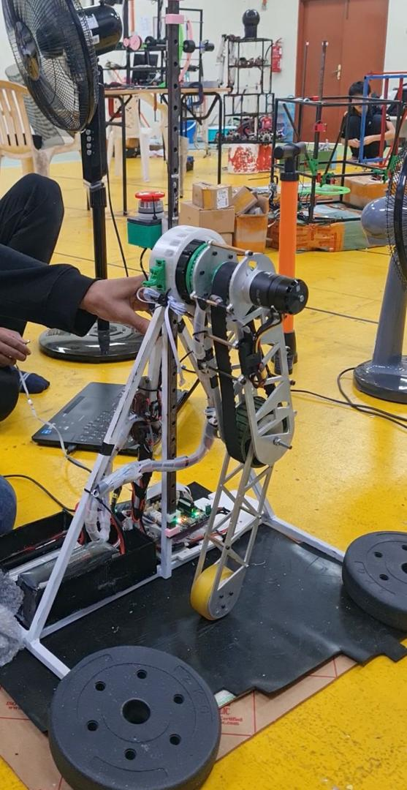

# Robotic Arm & Jumping Robot Control System

## 📖 Project Overview
This project involves the development of a high-precision control system originally designed for a robotic arm and subsequently evolved to power a dynamic jumping robot. 

The core focus lies in the implementation of advanced kinematic algorithms and trajectory planning to ensure smooth, precise motion. To handle rapid dynamics and ensure hardware longevity, the system integrates robust safety features including active torque monitoring and joint limit enforcement.

  
   
  <em>Figure 1: Jumping Joint Prototype.</em>

**Demo:** (https://drive.google.com/file/d/1CBArjczUFCylm3Fq0pCKf-ga2mQEULir/view)

## 🚀 Key Features

* **Advanced Kinematics:** * Implemented **Forward Kinematics** to determine end-effector position based on joint angles.
    * Implemented **Inverse Kinematics** to calculate required joint angles for desired target coordinates.
* **Trajectory Planning:** Developed algorithms to generate smooth motion paths, reducing mechanical stress and improving accuracy.
* **Dynamic Stability:** Adapted arm control logic to support the rapid, high-force dynamics required for a jumping mechanism.
* **Safety Integration:**
    * **Joint Limits:** Software-defined constraints to prevent mechanical over-extension.
    * **Torque Monitoring:** Real-time current/torque sensing to detect obstructions and maintain stable operation.

## 🛠 Tech Stack

* **Hardware/Embedded:** STM32 Microcontrollers
* **Simulation & Modeling:** MATLAB
* **Core Concepts:** Forward/Inverse Kinematics, Trajectory Planning, PID Control
* **Domain:** IoT & Embedded Systems

## 📸 Project Gallery

*(Note: If you have more images or GIFs of the robot jumping or moving, place them here. Below is a placeholder description based on your current image)*

The system utilizes a belt-driven actuator mechanism controlled by an STM32 unit, capable of precise angular positioning and high-torque output for jumping maneuvers.

## 🔧 Installation & Setup

1.  **Hardware Used:**
    * STM32 Development Board (F4 series).
    * Motor Drivers and Actuators (Belt drive assembly).

2.  **Software Prerequisites:**
    * MATLAB (for simulation and algorithm verification).
    * STM32CubeIDE for firmware deployment.

